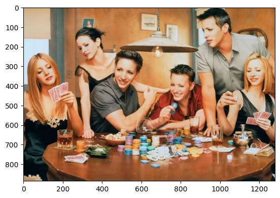

# Face Swapping

<p align="center">
  
</p>

## Setup
- Clone this repository.
- Download the trained model(inswapper_128.onnx) [here](https://www.reddit.com/r/midjourney/comments/13pnraj/please_reupload_inswapper_128onnx/). Put the file in the root folder.
<!-- or use `git lfs fetch` after cloning this repositry -->
- ```pip install -r requirements.txt```
- ```streamlit run app.py```
- The page will be ready on http://localhost:8501/.
## Reference
Inspired by Rob's [video](https://www.youtube.com/watch?v=a8vFMaH2aDw)


## Outlook 
<p align="center">
  
</p>
